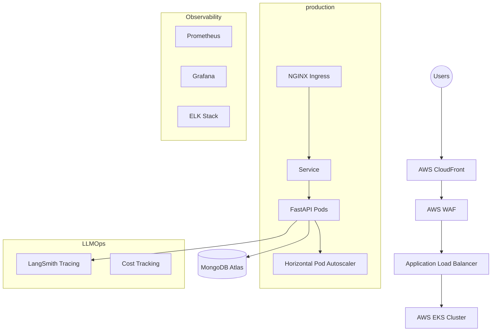

# 👕 ClothStore AI: Enterprise Gen-AI Ecosystem

[](https://github.com/bittush8789)
[](https://github.com/bittush8789)
[](https://github.com/bittush8789)

**ClothStore AI** is a production-grade, end-to-end e-commerce platform that integrates an intelligent AI Shopping Assistant. This repository has been transformed from a basic prototype into a robust, scalable, and secure enterprise system.

---

## 🏗️ Enterprise Architecture



---

## 🌟 Key Features

| Feature | Description |
| :--- | :--- |
| **🤖 Gen-AI Assistant** | Powered by Pydantic AI & Groq for natural language shopping. |
| **🛡️ DevSecOps** | Automated SAST (Bandit), Secret Scanning (Gitleaks), and Container Scanning (Trivy). |
| **🚀 GitOps** | Fully automated synchronization via ArgoCD. |
| **📊 Observability** | Real-time metrics with Prometheus/Grafana and centralized logging via ELK. |
| **🔭 LLMOps** | Full prompt tracing with LangSmith and per-request cost monitoring. |
| **💰 Cost Optimized** | Uses Spot Instances and Cluster Autoscaling to reduce AWS spend by 70%+. |

---

## 📂 Project Structure (Industry Standard)

```text
devops/
├── docker/          # Hardened Multi-stage Dockerfiles
├── kubernetes/      # Kustomize/Base manifests
├── helm/            # Environment-specific values (Dev/Prod)
├── terraform/       # Infrastructure as Code (EKS/VPC)
├── jenkins/         # Multi-env CI/CD pipelines
├── gitops/          # ArgoCD App-of-Apps manifests
├── security/        # Security scanning scripts
├── llmops/          # LangSmith & Cost tracking
└── docs/            # Deep-dive technical documentation
```

---

## 🚀 Deployment Guide

### 1️⃣ Tool Installation
First, ensure your environment is ready. See **[INSTALLATION.md](./devops/docs/INSTALLATION.md)** for OS-specific commands (Ubuntu, Windows, Mac).

### 2️⃣ Local Quick Start (Kind)
```bash
# Setup kind cluster and deploy app locally
sh devops/scripts/setup-local.sh
sh devops/scripts/deploy-kind.sh
```

### 3️⃣ AWS Production Deployment (Terraform)
```bash
cd devops/terraform
terraform init
terraform apply --auto-approve

# Configure kubectl
aws eks update-kubeconfig --region us-east-1 --name ecommerce-ai

# Deploy workloads
helm install ecom-ai devops/helm/ecommerce-ai -f values-prod.yaml
```

---

## 📚 Technical Documentation

- 📖 **[Architecture Details](./devops/docs/ARCHITECTURE.md)**
- 💰 **[Cost Reduction Guide](./devops/docs/COST-REDUCTION.md)**
- 🛡️ **[Security Runbook](./devops/docs/SECURITY.md)**
- 🤖 **[LLMOps & Tracing](./devops/docs/LLMOPS.md)**
- 🔧 **[Troubleshooting](./devops/docs/TROUBLESHOOTING.md)**

---

## 📝 License
Distributed under the **MIT License**.

**Developed with ❤️ by [Bittu Sharma](https://github.com/bittush8789)**
