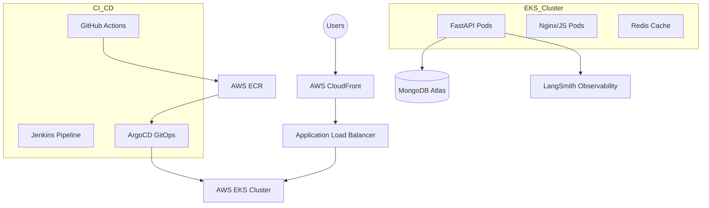

# Enterprise Architecture Overview

```mermaid
graph TD
    Users((Users)) --> CF[AWS CloudFront]
    CF --> ALB[Application Load Balancer]
    ALB --> EKS[AWS EKS Cluster]
    
    subgraph EKS_Cluster
        Backend[FastAPI Pods]
        Frontend[Nginx/JS Pods]
        Redis[Redis Cache]
    end
    
    Backend --> DB[(MongoDB Atlas)]
    Backend --> LS[LangSmith Observability]
    
    subgraph CI_CD
        GHA[GitHub Actions]
        Jenkins[Jenkins Pipeline]
        Argo[ArgoCD GitOps]
    end
    
    GHA --> ECR[AWS ECR]
    ECR --> Argo
    Argo --> EKS
```
